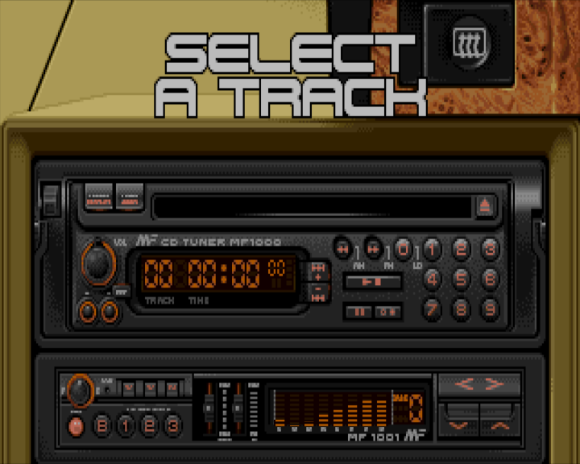

# lotus3-cdplayer

This is the CDPlayer from Lotus III. It play mod files from the game.
Use arrows to change track, space to pause.



# needs a http server

for example:

```
python -m http.server 1025
```

# sources

Original Music: Patrick Phelan

Original Graphics: Andrew Morris

Magnetic Fields (c) 1992

# deps

JS Mod Player: firehawk/tda
